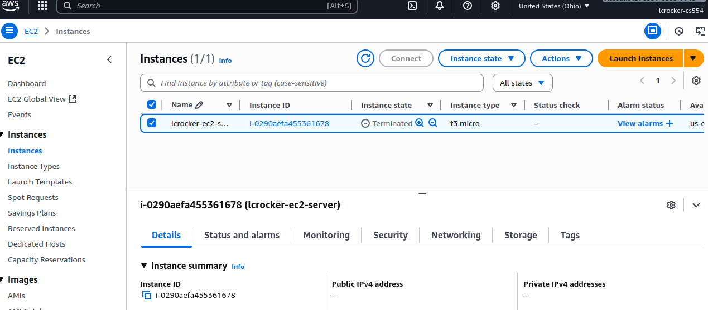

# Project 1 – EC2 REST Converter

This is a minimal Node.js/Express service that converts pounds (lbs) to kilograms (kg).

## Run locally

```bash
npm install
node server.js
```

Then test:

```bash
curl "http://localhost:8080/convert?lbs=150"
```

## Deploy on EC2

1. Launch EC2 (Amazon Linux 2 or Ubuntu).
2. Install in EC2: Node.js + npm.
3. In EC2, mkdir -p ~/p1 && cd ~/p1
4. In EC2, npm init -y
5. In EC2, npm install express morgan
6. In EC2, mkdir -p ~/.config/systemd/user/
7. In repo, scp -i generated_key.pem server.js ec2-user@<PUBLIC_IP>:/home/ec2-user/p1/
8. In repo, scp -i generated_key.pem p1.service ec2-user@<PUBLIC_IP>:/home/ec2-user/.config/systemd/user/
9. In EC2, systemctl --user daemon-reload
10. In EC2, systemctl --user enable p1
11. Adjust Security Group to allow inbound TCP/8080 (or use NGINX reverse proxy for port 80).

## Cleanup

When done, stop and terminate EC2 instance. Delete Security Groups and Key Pairs.





